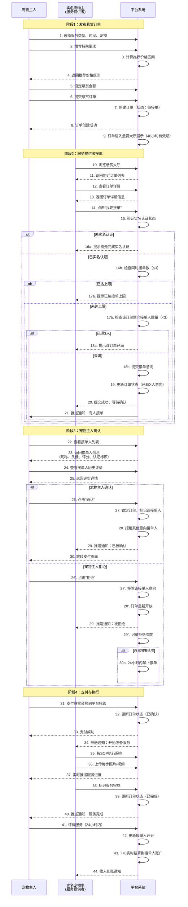
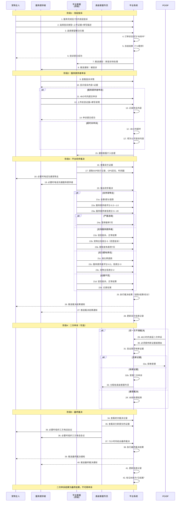

# PetCare宠伴 - 双模式接单流程泳道图

## 一、流程图说明

本文档描述PetCare宠伴平台的两种接单模式的完整业务流程，使用泳道图形式展示各角色之间的交互。

**涉及角色**：

- **宠物主人（Pet Owner）**：发布需求并支付费用的用户
- **服务提供者（Service Provider）**：包括实名宠物主和认证宠托师
- **平台系统（Platform）**：负责订单管理、匹配、支付托管等

---

## 二、模式一：悬赏大厅接单流程（C2C）

### 2.1 泳道图



### 2.2 关键业务规则

| 规则项             | 说明                                             |
| ------------------ | ------------------------------------------------ |
| **订单有效期**     | 48小时，超时自动关闭                             |
| **意向接单人上限** | 同一订单最多3人同时意向接单                      |
| **个人接单上限**   | 同一用户最多同时接3个悬赏订单                    |
| **确认/拒绝机制**  | 宠物主可查看接单人信息后决定，拒绝后订单重新开放 |
| **连续拒绝惩罚**   | 接单人连续被拒绝5次，24小时内禁止接单            |
| **支付时机**       | 宠物主确认后支付到平台托管                       |
| **结算周期**       | T+0实时结算到接单人微信零钱                      |
| **实名认证要求**   | 必须完成实名认证才能接单                         |

---

## 三、模式二：平台定价接单流程（B2C）

### 3.1 泳道图

```mermaid
sequenceDiagram
    participant PO as 宠物主人
    participant PS as 认证宠托师<br/>(服务提供者)
    participant PF as 平台系统

    Note over PO,PF: 阶段1：预约平台服务

    PO->>PF: 1. 选择服务类型、时间、宠物
    PO->>PF: 2. 填写特殊要求
    PF->>PF: 3. 查询平台统一定价
    PF-->>PO: 4. 显示固定价格（不可修改）
    PO->>PF: 5. 提交预约订单
    PF->>PF: 6. 创建订单（状态：待支付）
    PF-->>PO: 7. 跳转支付页面

    PO->>PF: 8. 支付平台定价到平台托管
    PF->>PF: 9. 更新订单状态（已预约）
    PF-->>PO: 10. 支付成功
    PF->>PF: 11. 订单进入派单池

    Note over PO,PF: 阶段2：系统派单

    PF->>PF: 12. 基于LBS匹配附近认证宠托师
    PF->>PF: 13. 筛选可服务时间段匹配的宠托师
    PF->>PF: 14. 按评分、距离、接单率排序
    PF->>PS: 15. 推送订单给前N名宠托师（最多5个）
    PF->>PF: 16. 启动15分钟倒计时

    Note over PO,PF: 阶段3：宠托师接单

    PS->>PF: 17. 接收新订单通知
    PF-->>PS: 18. 显示订单详情<br/>（服务类型、时间、地点模糊显示、费用）
    PS->>PF: 19. 查看订单详情

    alt 宠托师接受
        PS->>PF: 20. 点击"接受"
        PF->>PF: 21. 锁定订单，标记该宠托师
        PF->>PF: 22. 停止向其他宠托师推送
        PF-->>PS: 23. 接单成功，等待宠物主确认
        PF->>PO: 24. 推送通知：有宠托师接单
    else 宠托师拒绝
        PS->>PF: 20'. 点击"拒绝"并选择原因
        PF->>PF: 21'. 记录拒绝原因
        PF->>PF: 22'. 继续推送给下一位宠托师
        PF->>PF: 23'. 累计拒绝率统计
        alt 拒绝率>50%
            PF->>PF: 24a. 降低派单优先级
        end
    else 超时未响应
        PF->>PF: 20''. 15分钟超时
        PF->>PF: 21''. 自动释放订单
        PF->>PF: 22''. 继续推送给其他宠托师
    end

    Note over PO,PF: 阶段4：宠物主人确认

    PO->>PF: 25. 查看接单的宠托师信息
    PF-->>PO: 26. 返回宠托师信息<br/>（头像、昵称、评分、认证标签、服务次数）
    PO->>PF: 27. 查看宠托师历史评价
    PF-->>PO: 28. 返回评价详情

    alt 宠物主人确认
        PO->>PF: 29. 点击"确认"
        PF->>PF: 30. 锁定订单，进入服务流程
        PF-->>PS: 31. 推送通知：已被确认
        PF-->>PO: 32. 显示服务即将开始
    else 宠物主人打回
        PO->>PF: 29'. 点击"打回"
        PF->>PF: 30'. 记录打回次数
        alt 打回次数<3
            PF->>PF: 31a. 订单重新进入派单池
            PF->>PS: 32a. 推送通知：被宠物主打回
            PF->>PF: 33a. 继续推送给其他宠托师
        else 打回次数≥3
            PF->>PF: 31b. 第4次自动匹配当前宠托师
            PF->>PF: 32b. 锁定订单，进入服务流程
            PF-->>PS: 33b. 推送通知：自动确认
            PF-->>PO: 34b. 提示已自动匹配
        end
    end

    Note over PO,PF: 阶段5：执行服务

    PS->>PF: 35. 按SOP执行服务
    PS->>PF: 36. 上传每步照片/视频
    PF-->>PO: 37. 实时推送服务进度

    PS->>PF: 38. 标记服务完成
    PF->>PF: 39. 更新订单状态（已完成）
    PF-->>PO: 40. 推送通知：服务完成

    PO->>PF: 41. 评价服务（24小时内）
    PF->>PF: 42. 更新宠托师评分
    PF->>PF: 43. T+0实时结算到宠托师账户
    PF-->>PS: 44. 收入到账通知

    alt 评分<3.0
        PF->>PF: 45. 暂停宠托师接单资格
        PF->>PS: 46. 推送通知：需重新培训
    end
```



### 3.2 关键业务规则

| 规则项            | 说明                                                   |
| ----------------- | ------------------------------------------------------ |
| **定价权**        | 平台统一定价，宠物主不可修改                           |
| **派单机制**      | 基于LBS、时间匹配、评分排序，同时推送最多5个宠托师     |
| **接单时效**      | 15分钟内需响应，超时自动释放                           |
| **确认/打回机制** | 宠物主可查看宠托师信息后决定，最多打回3次              |
| **自动匹配**      | 第4次打回后自动匹配当前宠托师，不可再打回              |
| **拒绝率影响**    | 连续拒绝率>50%会降低派单优先级                         |
| **支付时机**      | 预约时立即支付到平台托管                               |
| **结算周期**      | T+0实时结算到宠托师微信零钱                            |
| **评分阈值**      | 评分<3.0星暂停接单，需重新培训                         |
| **认证要求**      | 必须完成认证宠托师认证（身份+微信支付分≥650+培训考试） |

---

## 四、两种模式对比

### 4.1 核心差异

| 维度           | 模式一：悬赏大厅               | 模式二：平台定价                        |
| -------------- | ------------------------------ | --------------------------------------- |
| **定价权**     | 宠物主自主定价（平台推荐区间） | 平台统一定价                            |
| **服务提供者** | 实名宠物主                     | 认证宠托师                              |
| **准入门槛**   | 仅需实名认证                   | 实名认证+微信支付分≥650+培训考试        |
| **匹配方式**   | 宠物主主动浏览，服务提供者抢单 | 系统智能派单                            |
| **选择权**     | 宠物主从最多3个意向者中选择    | 宠物主从接单的宠托师中选择（可打回3次） |
| **隐私保护**   | 接单后可见基本信息             | 接单后可见详细信息+评价                 |
| **专业性**     | 较低，灵活性强                 | 较高，标准化程度高                      |
| **价格区间**   | 相对较低，可议价空间大         | 相对固定，中等价位                      |
| **适用场景**   | 临时需求、预算敏感、信任熟人   | 重要场合、追求专业、注重保障            |

### 4.2 共同点

- **支付托管**：两种模式都采用平台托管，服务完成后结算
- **SOP执行**：都必须按照标准化流程执行服务
- **评价机制**：服务完成后宠物主可评价，影响服务提供者评分
- **隐私保护**：接单前不展示服务提供者详细信息
- **取消规则**：相同的取消政策和违约金比例

---

## 五、异常流程处理

### 5.1 悬赏订单异常

| 异常情况           | 处理方式                                         |
| ------------------ | ------------------------------------------------ |
| **48小时无人接单** | 订单自动关闭，无需宠物主操作                     |
| **接单人爽约**     | 宠物主可投诉，平台扣除接单人保证金，重新开放订单 |
| **服务过程违规**   | 宠物主可举报，平台核实后处罚接单人，部分退款     |
| **宠物主取消订单** | 按取消政策执行退款或扣违约金                     |

### 5.2 平台订单异常

| 异常情况           | 处理方式                                     |
| ------------------ | -------------------------------------------- |
| **15分钟无人接单** | 扩大推送范围，继续推送给更远的宠托师         |
| **宠托师爽约**     | 平台紧急联系其他宠托师，补偿宠物主优惠券     |
| **服务过程违规**   | 宠物主可投诉，平台核实后处罚宠托师，部分退款 |
| **宠物主取消订单** | 按取消政策执行退款或扣违约金                 |
| **连续打回3次**    | 第4次自动匹配，不可再打回                    |

---

## 六、数据流转说明

### 6.1 订单状态机

```
待接单/待支付
    ↓ (有人接单/支付成功)
已确认
    ↓ (服务开始)
服务中
    ↓ (SOP完成)
已完成
    ↓ (评价完成)
已评价
```

### 6.2 资金流转

```
宠物主支付
    ↓
平台托管账户
    ↓ (服务完成+T+0)
服务提供者微信零钱（实时到账）
```

### 6.3 评分更新

```
宠物主评价
    ↓
计算新的综合评分
    ↓
更新服务提供者档案
    ↓ (评分<3.0)
触发暂停接单机制
```

---

_文档版本：v1.0_  
_创建日期：2026-07-15_  
_作者：PetCare研发团队_

---

## 七、订单纠纷处理流程泳道图

### 7.1 完整纠纷处理流程



### 7.2 关键业务规则

| 规则项           | 说明                                       |
| ---------------- | ------------------------------------------ |
| **投诉时效**     | 服务完成后7天内可发起投诉                  |
| **申诉时效**     | 收到投诉后48小时内可申诉，超时视为认可     |
| **初步裁决时效** | 客服72小时内给出初步裁决                   |
| **二次申诉时效** | 初次裁决后48小时内可发起，需提供新证据     |
| **最终裁决时效** | 高级客服72小时内给出最终裁决               |
| **结算冻结**     | 纠纷期间冻结结算，裁决后自动执行           |
| **申诉次数**     | 仅1次二次申诉机会，结果为最终结果          |
| **滥用惩罚**     | 无新证据反复申诉将限制申诉权限             |
| **信用记录**     | 所有纠纷记录计入信用档案，影响后续功能使用 |

### 7.3 纠纷处理状态机

```
已完成
    ↓ (宠物主发起投诉)
纠纷中（结算冻结）
    ↓ (平台初步裁决)
已裁决
    ↓ (任一方二次申诉)
二次申诉中
    ↓ (高级客服最终裁决)
已结案（不可再申诉）
```

---

_文档版本：v1.1_  
_创建日期：2026-07-15_  
_最后更新：2026-07-15_  
_作者：PetCare研发团队_  
_变更说明：增加完整的订单纠纷处理流程泳道图，包括投诉发起、申诉回应、平台裁决、二次申诉等环节_
