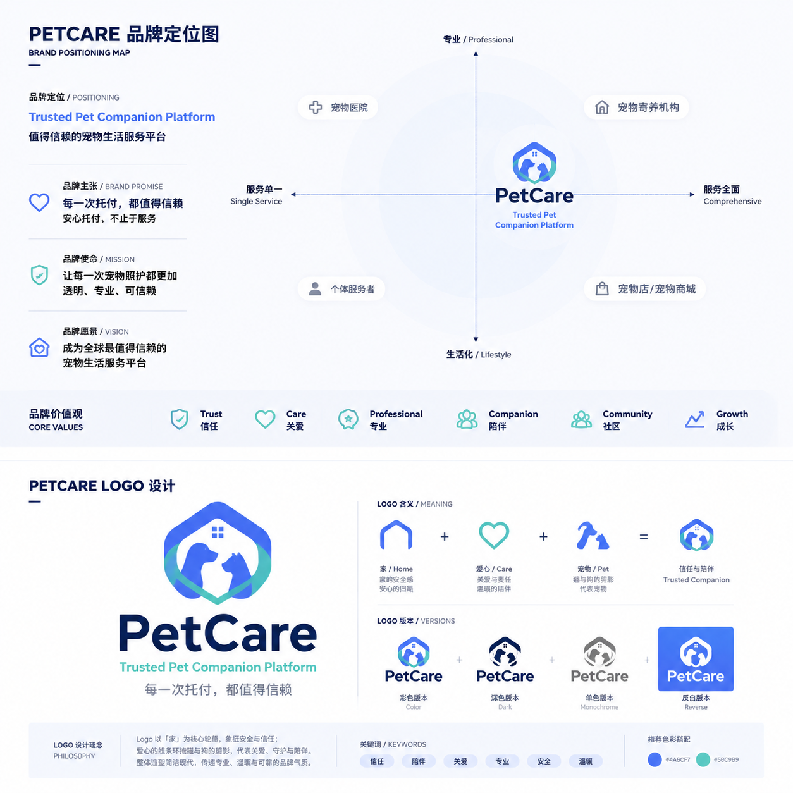

# PetCare Brand Book v1.0

> 宠伴企业级品牌设计系统。该文件是可版本管理的内容源；正式评审版见同目录 DOCX。

> 共 108 个设计页。品牌定位与 Logo 位图基准：`assets/petcare-brand-positioning-logo-v1.png`。

### 001 · PetCare Brand Book

宠伴品牌设计系统 · Version 1.0 · 2026

> **Brand Note:** 以信任为起点，以陪伴为过程，以安心为结果。

### 002 · 品牌北极星

每一个决策，都应该让宠物主人更安心地托付他们最重要的家人。

- Every decision should make pet owners feel more confident to entrust their beloved companions.
- 当效率、增长与信任发生冲突时，优先选择可验证、可解释、可追溯的方案。
- 这条原则同时约束产品、设计、内容、运营、客服、审核与服务履约。

### 003 · 文档身份与适用范围

本手册是 PetCare 品牌、产品体验与开发实现的共同规范。

| 项目     | 定义                                        |
| -------- | ------------------------------------------- |
| 版本     | v1.0 / 2026-08                              |
| 品牌     | PetCare（宠伴）                             |
| 适用端   | 微信小程序、Admin、官网、运营物料、服务现场 |
| 所有者   | 品牌负责人；产品、设计、研发共同维护        |
| 基准资产 | 用户提供的品牌定位图与 Logo 合成稿（位图）  |

> **Brand Note:** 位图仅作为视觉基准，不替代可交付的 SVG、PNG 多尺寸与图标母版。

### 004 · 如何使用这本手册

按角色阅读，而不是从第一页机械读到最后一页。

| 角色        | 优先章节               | 主要产出                         |
| ----------- | ---------------------- | -------------------------------- |
| 管理层/品牌 | 战略、治理、指标       | 定位决策与审批                   |
| 产品/UX     | 体验原则、文案、状态   | 流程、原型、验收                 |
| 视觉/UI     | Logo、色彩、字体、图像 | 设计系统与页面                   |
| 研发        | Token、资产、组件映射  | ~~React/Taro~~ React/UniApp 实现 |
| 运营/客服   | 语气、应用、模板       | 内容与服务沟通                   |

### 005 · 内容地图 01

从品牌为何存在，走向品牌如何表达。

- 01–07 导读与使用方式
- 08–30 品牌战略：定位、价值、人格、品牌架构与信任证据
- 31–44 语言系统：品牌声音、产品文案、通知、社区与本地化
- 45–58 标识系统：Logo 概念、版本、尺寸、响应式与资产管理

### 006 · 内容地图 02

从视觉语言，走向产品体验与工程治理。

- 59–76 视觉系统：色彩、字体、栅格、图标、摄影、插画与数据可视化
- 77–85 UX 系统：信任旅程、双模式、SOP、状态、安全、无障碍与动效
- 86–92 品牌应用：小程序、订单证据、Admin、官网、通知与线下
- 93–108 实施与治理：Token、代码映射、资产、QA、版本、AI 规则与术语

### 007 · PetCare 一页总览

Trusted Pet Companion Platform · 值得信赖的宠物生活服务平台。

| 维度     | PetCare 定义                          |
| -------- | ------------------------------------- |
| 品牌核心 | Trusted Companion / 值得信赖的陪伴    |
| 品牌主张 | 每一次托付，都值得信赖                |
| 主口号   | 陪伴每一次托付                        |
| 品牌人格 | 守护者 × 引导者                       |
| 业务模式 | C2C 悬赏大厅 + B2C 平台定价           |
| 体验抓手 | 认证、SOP、过程证明、评价、申诉与社区 |

## 008 · 01 · Brand Strategy

品牌战略

> **Brand Note:** PetCare 不售卖一次服务；PetCare 建立一套让托付持续可信的关系。

### 009 · 业务背景

PetCare 连接宠物主人与服务提供者，提供上门喂养、遛狗、陪玩等 O2O 服务。

- C2C：宠物主人发布悬赏，市场撮合与自主定价。
- B2C：平台提供标准价格、服务承诺与更强履约控制。
- 社区：用真实经验、内容与关系提升长期留存。
- SOP：用可执行步骤、图片视频与定位记录建立信任证据。

### 010 · 品类张力

用户真正购买的不是“有人上门”，而是“我不在时，它仍被认真照顾”。

| 用户担忧         | 品牌回应                         |
| ---------------- | -------------------------------- |
| 陌生人进入家中   | 认证、授权、轨迹与审计           |
| 服务是否真的完成 | SOP、时间、定位、图片与视频      |
| 价格是否合理     | 模式标签、价格构成与规则透明     |
| 发生异常怎么办   | 实时反馈、客服、申诉与证据链     |
| 下次还能否放心   | 评价、复购、熟悉宠托师与长期档案 |

### 011 · 核心受众 · 宠物主人

把宠物视为家人，同时需要在工作、出差或旅行时获得可信照护。

- 目标：快速找到合适服务者，明确知道价格、时间与服务内容。
- 情绪：离家前焦虑，服务中需要确定性，完成后需要安心和复盘。
- 成功信号：愿意首次下单、查看证据、再次预约并推荐给朋友。
- 设计重点：默认展示安全信息、过程状态和下一步，而非堆叠促销。

### 012 · 核心受众 · 宠托师

以经验与责任换取收入、认可和可持续成长的服务提供者。

- 目标：获得合适订单、清楚理解要求、低摩擦完成 SOP、按时结算。
- 痛点：规则不清、临时变更、证据标准不一、评价不公平。
- 品牌责任：尊重劳动，不把宠托师表现为随叫随到的廉价劳动力。
- 成长路径：认证 → 首单 → 稳定履约 → 优质标签 → 长期客户。

### 013 · 关键受众 · 运营与审核

品牌信任最终由后台的审核、申诉、风控和服务响应兑现。

- 运营需要清晰、可比较、可追溯的数据，而不是装饰性界面。
- 审核需要证据上下文、操作理由、权限边界和审计记录。
- 客服需要一致话术、风险等级与升级路径。
- 品牌承诺必须能被后台流程支持，否则不得对外承诺。

### 014 · Jobs to Be Done

围绕用户需要完成的“任务”，组织品牌价值。

| 情境       | 用户任务                 | 品牌结果           |
| ---------- | ------------------------ | ------------------ |
| 临时离家   | 在有限时间内找到可信服务 | 快速而不草率       |
| 服务进行中 | 确认宠物状态与照护进度   | 持续可见、可追溯   |
| 发生异常   | 理解情况并获得处理       | 及时、诚实、有依据 |
| 再次需要   | 复用已验证的关系         | 减少重新判断成本   |
| 服务者成长 | 把专业积累转化为信誉     | 公平、透明、可持续 |

### 015 · 品牌定位图 · v1.0

当前定位：专业度较高、服务覆盖较全面；区别于单一服务者、宠物店/商城、医院和寄养机构。



> **Brand Note:** 本页采用用户确认的品牌定位与 Logo 合成稿。后续重绘不得改变“专业 × 全面”的目标象限。

### 016 · 定位陈述

对于重视宠物安全与服务透明的现代宠物家庭，PetCare 是值得信赖的宠物生活服务平台。

- 它通过双模式供给，兼顾灵活撮合与标准化服务。
- 它通过认证、SOP、服务证据与申诉机制降低不确定性。
- 它通过社区与长期档案，把一次订单转化为持续关系。
- 它不是宠物医院、商城或简单的信息黄页。

### 017 · 品牌承诺

每一次托付，都值得信赖。

#### 对宠物主人

服务前说清楚，服务中看得见，服务后有记录，异常时有回应。

#### 对宠托师

规则清楚、要求明确、证据标准统一、劳动价值被尊重。

#### 对平台

不隐瞒费用、不伪造评价、不以增长牺牲安全与公平。

### 018 · 品牌本质

Trusted Companion · 值得信赖的陪伴。

- Trust 是门槛：真实、透明、可验证、可追溯。
- Companion 是关系：长期、温暖、有回应、不止于一次订单。
- Technology 是手段：降低不确定性，而不是制造冰冷流程。
- Care 是结果：宠物被认真照顾，主人能够安心离开。

> **Brand Note:** 品牌本质用于内部决策，不要求在所有外部页面重复出现。

### 019 · 使命与愿景

使命解决今天，愿景指向长期。

| 层级   | 表述                                       | 检验方式                       |
| ------ | ------------------------------------------ | ------------------------------ |
| 使命   | 让每一次宠物照护都更加透明、专业、可信赖。 | 产品是否减少了托付的不确定性   |
| 愿景   | 成为全球值得信赖的宠物生活服务平台。       | 用户是否愿意长期使用并主动推荐 |
| 北极星 | 每个决策都让宠物主人更安心地托付。         | 发生取舍时是否优先保护信任     |

### 020 · 品牌故事

当宠物成为家庭成员，离开家不再只是行程安排，也是一份牵挂。

#### 起点

市场并不缺“能上门的人”，缺的是能被理解、比较、验证和长期信赖的服务关系。

#### 方法

PetCare 将服务者、流程、证据、支付、评价与社区连接为一个完整体验。

#### 未来

让宠物家庭在任何需要时，都能找到熟悉、可靠且被尊重的照护方式。

### 021 · 品牌宣言

真正重要的，从来不是一次服务。

- 当你无法陪伴的时候，它依然被认真照顾。
- 每一次开门，都是一份信任；每一次记录，都是一份安心。
- 我们守护的不只是宠物，也是人与宠物之间最珍贵的情感连接。
- PetCare，陪伴每一次托付。

### 022 · 核心价值观 01

Trust · Care · Professional

| 价值              | 我们相信                 | 行为证据                     |
| ----------------- | ------------------------ | ---------------------------- |
| Trust 信任        | 透明比包装更有力量       | 真实评价、证据链、费用说明   |
| Care 关爱         | 关心宠物，也关心主人情绪 | 状态更新、异常说明、温暖文案 |
| Professional 专业 | 标准使承诺可以复现       | 认证、培训、SOP、审计        |

### 023 · 核心价值观 02

Companion · Community · Growth

| 价值           | 我们相信                 | 行为证据                   |
| -------------- | ------------------------ | -------------------------- |
| Companion 陪伴 | 一次服务是长期关系的开始 | 复购、熟悉宠托师、成长档案 |
| Community 社区 | 真实经验能够帮助更多家庭 | 内容规范、知识分享、互助   |
| Growth 成长    | 平台与服务双方共同进步   | 培训、评级、反馈与机会     |

### 024 · 品牌原型

主原型：The Caregiver 守护者；辅原型：The Guide 引导者。

#### 守护者

温暖、负责、耐心，优先保护宠物与家庭的安全。风险是过度承诺或替用户做决定。

#### 引导者

清晰、专业、可解释，帮助用户理解流程与下一步。风险是显得冷漠或说教。

#### 组合原则

先给予安全感，再提供清晰行动；先承认情绪，再解释事实。

### 025 · 品牌人格

如果 PetCare 是一个人，它值得信赖、温暖、细心、现代且克制。

| 我们是 | 但不是       |
| ------ | ------------ |
| 专业   | 权威压迫     |
| 温暖   | 过度卖萌     |
| 清晰   | 机械生硬     |
| 积极   | 虚假乐观     |
| 克制   | 冷淡疏离     |
| 现代   | 追逐短期潮流 |

### 026 · 品牌情绪目标

品牌首先管理情绪，再帮助用户完成任务。

| 阶段   | 进入时情绪   | 离开时情绪     |
| ------ | ------------ | -------------- |
| 浏览   | 不确定、比较 | 理解、可选择   |
| 下单   | 担心遗漏     | 确认、可预期   |
| 服务中 | 牵挂、焦虑   | 可见、安心     |
| 异常   | 紧张、质疑   | 被重视、有方案 |
| 完成   | 等待验证     | 满意、愿意复购 |

### 027 · 品牌体验金字塔

专业是底座，品牌热爱是长期结果。

- Professional：服务标准与能力真实存在。
- Transparency：价格、过程、证据与规则可理解。
- Trust：用户愿意把宠物与家庭空间交给平台。
- Satisfaction：结果符合预期，异常得到处理。
- Loyalty：优先复购、固定服务者、持续使用。
- Love：主动推荐，愿意参与社区与共建。

### 028 · 品牌架构

采用单一主品牌 + 清晰服务描述，避免过早创建多个子品牌。

| 层级     | 命名原则                  | 示例                         |
| -------- | ------------------------- | ---------------------------- |
| 主品牌   | 统一使用 PetCare / 宠伴   | PetCare 宠伴                 |
| 交易模式 | 描述性命名，不独立做 Logo | 悬赏服务 / 平台服务          |
| 功能模块 | 用户能直接理解            | 宠物角、照护记录、宠托师认证 |
| 运营计划 | 主品牌背书 + 活动名       | PetCare 新手守护计划         |

### 029 · 服务命名原则

中文优先表达任务，英文仅用于品牌与专业语境。

- 统一用“宠托师”，不用“保姆”“阿姨”“接单人”。
- 统一用“照护”，按具体服务使用“上门喂养 / 遛狗 / 陪玩”。
- C2C 对用户显示“悬赏服务”，B2C 显示“平台服务”。
- 证据集合统一称“照护记录”，过程步骤称“SOP 步骤”。
- 纠纷流程用“申诉与处理”，避免先入为主使用“投诉有罪”。

### 030 · 信任证据体系

品牌承诺必须由产品证据支撑。

| 信任层 | 证据                   | 用户可见方式       |
| ------ | ---------------------- | ------------------ |
| 身份   | 实名、认证、培训       | 认证标识与有效期   |
| 过程   | 时间、GPS、SOP、媒体   | 时间轴与照护记录   |
| 交易   | 价格、支付、退款、结算 | 费用明细与状态     |
| 声誉   | 评价、完成率、复购     | 结构化评分与历史   |
| 治理   | 审核、申诉、审计       | 处理进度与结论依据 |

## 031 · 02 · Verbal Identity

品牌语言与文案系统

> **Brand Note:** 专业但不冷漠；温暖但不卖萌；清晰但不命令。

### 032 · 品牌声音

PetCare 的声音在不同场景变化，但人格保持一致。

- Trustworthy：陈述事实，明确证据与边界。
- Warm：承认用户的牵挂，使用自然的人类语言。
- Clear：一句话一个重点，先结果后解释。
- Professional：术语一致，时间、金额、责任表达准确。
- Respectful：尊重宠物主人、服务者与社区参与者。

### 033 · 五条写作原则

所有文案都应通过这五个问题。

- 先说用户最需要知道的结果。
- 使用具体动作与时间，不用模糊承诺。
- 说明为什么需要信息或权限。
- 错误信息同时给出恢复路径。
- 避免夸张、羞辱、恐吓、诱导和行业黑话。

> **Brand Note:** 推荐句式：发生了什么 → 对你意味着什么 → 你可以怎么做。

### 034 · 情境语气矩阵

语气强度应跟随风险与情绪，而不是跟随营销目标。

| 场景      | 语气       | 示例                                   |
| --------- | ---------- | -------------------------------------- |
| 发现/浏览 | 轻松、清晰 | 看看附近值得信赖的照护服务             |
| 支付/授权 | 准确、克制 | 确认后将支付 ¥80，费用明细如下         |
| 服务中    | 安心、具体 | 宠托师已到达，正在进行第 2 项照护      |
| 异常/申诉 | 同理、严谨 | 我们已记录异常，专员将在 30 分钟内联系 |
| 社区      | 友好、尊重 | 分享真实经验，也请保护他人隐私         |

### 035 · 术语表 · 面向用户

统一术语可以减少误解与客服成本。

| 推荐     | 避免        | 说明                   |
| -------- | ----------- | ---------------------- |
| 宠托师   | 保姆/阿姨   | 专业、无性别偏见       |
| 照护服务 | 代养/看一下 | 体现责任与标准         |
| 照护记录 | 证明材料    | 对用户更自然           |
| 悬赏服务 | 自由单/散单 | 突出自主定价           |
| 平台服务 | 官方单      | 避免暗示政府或绝对担保 |
| 申诉     | 闹纠纷      | 中性且可治理           |

### 036 · 口号系统

主口号稳定使用；活动口号不替代品牌口号。

| 级别     | 文案                           | 用途                         |
| -------- | ------------------------------ | ---------------------------- |
| 主口号   | 陪伴每一次托付                 | 品牌首页、启动页、Brand Book |
| 品牌承诺 | 每一次托付，都值得信赖         | 战略、信任场景、服务说明     |
| 英文主张 | Trusted Pet Companion Platform | 英文品牌介绍                 |
| 体验句   | 安心托付，不止于服务           | 内容与活动                   |
| 服务句   | 每一次照护，都有记录           | SOP 与证据页                 |

### 037 · 首页关键文案

首页同时承载信任建立与双模式分流。

#### Hero

放心出发，它会被认真照顾。

#### 副标题

上门喂养、遛狗与陪玩；服务过程可查看，费用与规则更透明。

#### C2C 入口

发布悬赏 · 自主设置预算与时间

#### B2C 入口

预约平台服务 · 标准价格与服务流程

#### 信任条

实名宠托师 · SOP 照护记录 · 平台申诉支持

### 038 · 订单生命周期文案

状态命名同时说明“现在发生什么”和“下一步是什么”。

| 状态   | 面向主人                       | 面向宠托师                   |
| ------ | ------------------------------ | ---------------------------- |
| 待接单 | 正在为你匹配合适的宠托师       | 有一个符合你服务范围的新需求 |
| 待开始 | 宠托师已确认，将按约定时间到达 | 请提前查看宠物与入户说明     |
| 服务中 | 照护正在进行，可查看实时记录   | 按 SOP 完成并上传记录        |
| 待确认 | 照护已完成，请查看记录         | 已提交记录，等待确认         |
| 已完成 | 本次照护已完成，感谢信任       | 收入已进入结算流程           |

### 039 · SOP 与服务证明文案

证明不应让宠托师感到被怀疑，而应被解释为共同保护。

- 到达：已记录到达时间与位置。
- 环境确认：请确认门窗、饮水与宠物状态。
- 核心照护：按本次订单要求完成喂养、清洁或陪玩。
- 状态反馈：用图片、视频和简短文字说明宠物状态。
- 离开确认：检查水电门窗，并提交完整照护记录。
- 帮助文案：记录会同时保护宠物主人与宠托师的权益。

### 040 · 安全与申诉文案

在高风险场景中，少用安慰性套话，多用事实、时限与责任人。

| 不推荐             | 推荐                                                           |
| ------------------ | -------------------------------------------------------------- |
| 别担心，我们会处理 | 我们已记录该情况，工单号 PC-2026-001；专员将在 30 分钟内联系你 |
| 上传证据           | 请上传与本次服务相关的照片、视频或沟通记录，用于核实           |
| 你的投诉失败       | 现有证据不足以支持退款；你可在 48 小时内补充材料               |
| 宠托师违规         | 经核实，本次服务未完成第 3 项 SOP，平台已按规则处理            |

### 041 · 错误、空状态与加载

状态页也应该帮助用户继续前进。

| 类型     | 结构               | 示例                                                     |
| -------- | ------------------ | -------------------------------------------------------- |
| 错误     | 原因 + 影响 + 恢复 | 定位未开启，暂时无法完成到达记录；请在系统设置中允许定位 |
| 空状态   | 现状 + 价值 + 行动 | 还没有照护记录。完成首次服务后，可在这里查看全过程       |
| 加载     | 当前动作 + 预期    | 正在上传视频，请保持页面开启                             |
| 无权限   | 边界 + 申请路径    | 你暂无退款审核权限，可联系主管处理                       |
| 网络失败 | 保留结果 + 重试    | 记录已保存在本机，网络恢复后可重新提交                   |

### 042 · 社区内容语气

社区可以轻松，但不能牺牲真实、隐私与尊重。

- 鼓励：分享真实养宠经验、服务体验与有依据的知识。
- 避免：以“萌”为唯一价值、过度拟人、攻击品种或服务者。
- 提醒：发布前遮挡门牌、电话、定位与他人面部信息。
- 审核：说明违反的具体规则，并提供申诉入口。
- 运营标题：具体、有帮助，不过度制造焦虑或使用绝对化结论。

### 043 · Admin 与 B2B 语言

后台强调准确、责任和可审计性。

- 按钮使用明确动作：通过认证、驳回并说明、发起退款、冻结账号。
- 高风险动作必须写清影响范围与是否可恢复。
- 状态避免只用颜色；同时显示文字、时间、操作者与原因。
- 数据指标必须带口径、时间范围和更新时间。
- 内部术语可以专业，但禁止把技术错误直接暴露给普通用户。

### 044 · 无障碍与本地化文案

文案首先要能被理解，其次才是风格。

- 中文避免连续英文缩写；首次出现 SOP 时补充“标准服务流程”。
- 数字、日期、货币使用本地格式；金额同时说明计价单位。
- 屏幕阅读器标签描述动作结果，例如“播放第 2 条照护视频”。
- 不要仅用“这里、上方、红色”指代界面元素。
- 英文版不逐字翻译中文情绪句，优先保持意义与自然语序。

## 045 · 03 · Identity System

品牌标识系统

> **Brand Note:** Logo 是识别入口，不是页面主角。

### 046 · 当前品牌资产

用户确认的 v1.0 合成稿包含品牌定位、核心价值、Logo 含义与四色版本。

- 蓝色外轮廓表达家与安全边界。
- 绿色弧线表达关爱、连接与持续陪伴。
- 猫狗负空间建立品类识别。
- 当前稿为位图，不应直接用于生产环境缩放。


### 047 · Logo 概念

Home × Care × Pet = Trusted Companion。

#### 家

外部几何轮廓形成安全空间与归属感。

#### 关爱

柔和的蓝绿连接关系，表达照护而非医疗。

#### 宠物

猫狗剪影建立快速识别，但整体保持符号化。

#### 信任

闭合结构与稳定重心传达可靠与长期。

### 048 · 几何与重绘要求

生产母版必须重新建立为矢量，不从位图自动描摹直接交付。

- 使用统一的 8px 构造网格与对称轴。
- 轮廓节点应为整数坐标，减少小尺寸渲染毛刺。
- 猫狗负空间需在 16px 和 20px 下做可辨识性测试。
- 蓝绿交接处避免过细、过尖或产生不必要空洞。
- 母版需包含彩色、深色、单色与反白四种 SVG。

> **Brand Note:** 本手册不宣称位图中的几何已达到最终 SVG 精度。

### 049 · Logo 版本体系

响应式标识随可用空间逐级简化。

| 版本       | 组成                             | 使用场景                   |
| ---------- | -------------------------------- | -------------------------- |
| Primary    | Symbol + PetCare + 中文/主张可选 | 品牌页、官网页脚、正式材料 |
| Compact    | Symbol + PetCare                 | Header、登录页、Admin      |
| Symbol     | 图形标                           | App、小程序、头像、窄导航  |
| Micro      | 简化图形                         | 16–20px favicon 与密集列表 |
| Monochrome | 单色图形/组合                    | 打印、压印、受限背景       |

### 050 · 安全区

Logo 四周至少保留 0.25H 的净空，H 为图形标高度。

- Primary Logo：文字与图形整体外侧均应用安全区。
- App Icon：安全区由系统图标模板另行控制，不额外加白边。
- 导航：图形与 PetCare 字标之间的固定间距为 0.24H。
- 不得把状态徽标、活动角标或合作方 Logo 放入安全区。
- Hero 中 Logo 仅作识别，面积不超过画面 2%。

### 051 · 最小尺寸

尺寸下限由可识别性决定，不由视觉偏好决定。

| 场景          | 建议尺寸      | 允许版本          |
| ------------- | ------------- | ----------------- |
| Favicon       | 16×16 / 20×20 | Micro             |
| 按钮图标      | 16×16         | Micro / 单色      |
| 列表/状态     | 20×20         | Symbol 简化版     |
| Web Header    | 32×32         | Compact           |
| 品牌标题      | 48×48         | Primary / Compact |
| 品牌展示      | 64×64         | Primary           |
| App Icon 母版 | 1024×1024     | Symbol            |

### 052 · 响应式 Logo

先减少文字，再简化细节，不通过整体缩小解决空间问题。

- ≥240px：图形 + PetCare + 可选中文或主张。
- 120–239px：图形 + PetCare。
- 32–119px：仅图形标。
- 16–31px：Micro 版，去除窗格与过细负空间。
- 任何尺寸不得重新排版、压缩字距或改变图文比例。

### 053 · 背景使用

优先保证清晰度与安静的品牌气质。

| 背景     | 推荐版本           | 要求               |
| -------- | ------------------ | ------------------ |
| 白/浅灰  | 彩色或深蓝         | 默认场景           |
| 品牌蓝   | 纯白反白           | 禁止叠加彩色渐变标 |
| 照片浅区 | 深蓝或带白色安全底 | 对比度清晰         |
| 照片深区 | 白色反白           | 避免跨越复杂纹理   |
| 单色印刷 | 100% 黑或专色      | 不使用灰度渐变     |

### 054 · 禁止用法

不正确的使用会削弱识别与信任。

- 禁止拉伸、倾斜、旋转或改变图文比例。
- 禁止自行替换蓝绿颜色或添加未定义渐变。
- 禁止添加投影、发光、描边、纹理或 3D 效果。
- 禁止把 Logo 放入宠物爪印、圆形徽章等二次容器。
- 禁止直接截取合成图中的 Logo 用于正式产品。
- 禁止在复杂照片上缺少安全底或对比度检查。

### 055 · App Icon 与 Favicon

图标不是缩小版海报，而是高频识别资产。

- App/小程序：使用 Symbol，保留系统圆角裁切安全区。
- 1024px 母版不预先裁圆角，不添加外部阴影。
- 48px 以下逐步减少窗格与动物细节。
- 深浅主题分别提供静态资源，禁止运行时滤镜反色。
- Favicon 测试 16px、20px、32px 的边缘清晰度。

### 056 · 联合品牌

合作方标识与 PetCare 平等、清晰、不过度拥挤。

- 使用 1px 中性分隔线，分隔线高度不超过 Logo 高度 70%。
- 双方图形视觉面积近似，不机械使用相同宽度。
- 合作活动不得改变 PetCare 主色或图形结构。
- “Powered by PetCare”用于能力输出；“PetCare × Partner”用于共同主办。
- 涉及保险、支付、地图时，不得暗示合作方对全部服务背书。

### 057 · 资产命名与目录

可预测的命名让设计与研发使用同一资产。

- 文件名使用小写 kebab-case。
- 颜色模式、版本和尺寸必须进入文件名。
- SVG 不嵌入位图，不包含编辑器私有元数据。

```text
assets/brand/
  logo/
    petcare-logo-primary-light.svg
    petcare-logo-primary-dark.svg
    petcare-symbol-color.svg
    petcare-symbol-mono.svg
    petcare-symbol-micro-16.svg
  app-icon/
  favicon/
  social/
  legal/
```

### 058 · Logo 验收门槛

最终矢量资产必须在交付前通过以下检查。

- 几何：节点、对称、负空间、视重心。
- 小尺寸：16/20/24/32/48/64px 截图对比。
- 背景：浅色、深色、照片、灰度打印。
- 技术：SVG viewBox、无外链字体、无多余 group、可 tree-shake。
- 无障碍：非文字 Logo 有可用的替代文本；装饰性 Logo 可被忽略。
- 法务：名称、图形与域名商标检索另行完成。

## 059 · 04 · Visual System

视觉设计系统

> **Brand Note:** 柔和但不软弱，现代但不冰冷，专业但不医疗。

### 060 · 色彩哲学

蓝色建立可信与秩序，薄荷绿传递关爱与陪伴，琥珀色提示行动与温度。

- 品牌蓝用于主行动、重点信息和品牌识别。
- 薄荷绿用于陪伴、完成、成长与温和辅助。
- 琥珀色用于提醒、悬赏价格与有限度强调。
- 红色仅用于危险、失败和不可逆操作。
- 大面积背景保持中性，让宠物内容和证据成为主角。

### 061 · 品牌色阶

色阶用于交互状态，不随意通过透明度临时生成。

| Token       | HEX     | 用途        |
| ----------- | ------- | ----------- |
| primary-50  | #EEF2FF | 浅品牌面    |
| primary-100 | #DCE5FF | 选中背景    |
| primary-500 | #4A6CF7 | 主色/主按钮 |
| primary-600 | #3F5FE0 | Hover       |
| primary-700 | #3552C8 | Active      |
| mint-50     | #ECFBF8 | 柔和成功面  |
| mint-500    | #5BC8AF | 辅助品牌色  |
| amber-500   | #F6B343 | 提醒与悬赏  |

### 062 · 语义色

语义色表达系统状态，不替代文字与图标。

| 语义    | 主色    | 浅色面  | 使用             |
| ------- | ------- | ------- | ---------------- |
| Success | #16866E | #EAF8F4 | 已完成、已通过   |
| Info    | #3552C8 | #EEF2FF | 处理中、说明     |
| Warning | #B26A00 | #FFF5DF | 需关注、即将超时 |
| Danger  | #C23B43 | #FDECEE | 失败、危险、拒绝 |
| Neutral | #667085 | #F2F4F7 | 停用、次要状态   |

### 063 · 深色模式

深色模式不是简单反色，应保持层级与宠物媒体内容的真实。

- Canvas #0F172A；Surface #172033；Elevated #202A3E。
- Text Primary #F8FAFC；Secondary #CBD5E1；Border #334155。
- 品牌蓝提高亮度至 #6F8BFF，薄荷绿使用 #73D6C0。
- 媒体、地图和视频不整体加暗色滤镜。
- 危险色需在深色背景重新测试对比度与色盲可辨识性。

### 064 · 色彩对比与可访问性

正文与关键操作至少满足 WCAG 2.2 AA。

- 普通文字对比度 ≥4.5:1；大号文字 ≥3:1。
- 图标、边界和焦点指示器 ≥3:1。
- 禁用态可以降低强调，但文字仍需可读。
- 不得仅靠红/绿区分订单或审核状态。
- 任何新 Token 合并前必须完成 Light/Dark 对比测试。

### 065 · 字体系统

中文以思源黑体为品牌基准；工程回退保证跨端可用。

| 角色      | 首选                 | 回退                                       |
| --------- | -------------------- | ------------------------------------------ |
| 中文 UI   | Source Han Sans SC   | PingFang SC / Microsoft YaHei / sans-serif |
| 英文品牌  | Montserrat           | Arial / sans-serif                         |
| 正文数字  | 系统字体等宽数字特性 | Arial                                      |
| 代码/标识 | JetBrains Mono       | Consolas / monospace                       |

> **Brand Note:** LOGO 字标应转曲为矢量；产品 UI 不加载不必要的品牌字体字重。

### 066 · 字体层级

Admin 默认 14px；小程序与移动端正文优先 14–16px。

| Token      | Size/Line | Weight | 用途           |
| ---------- | --------- | ------ | -------------- |
| display-lg | 40/48     | 700    | 品牌页面       |
| h1         | 32/40     | 700    | 页面主标题     |
| h2         | 24/32     | 700    | 主要分区       |
| h3         | 20/28     | 600    | 卡片组标题     |
| title      | 16/24     | 600    | 卡片标题       |
| body       | 14/22     | 400    | 默认正文       |
| body-lg    | 16/26     | 400    | 移动端主要阅读 |
| caption    | 12/18     | 400    | 辅助信息       |

### 067 · 排版规则

清晰的层级比更多字重更重要。

- 中文不使用全大写效果；英文标签可使用全大写但增加字距。
- 每行中文正文建议 28–42 字，长文不超过 48 字。
- 金额、时间与订单号使用 tabular numerals，便于纵向比较。
- 标题避免孤行；数字与单位、日期与时间尽量不拆行。
- 不在产品界面使用低于 12px 的可读文字。

### 068 · 栅格与容器

统一响应式栅格，但不强求小程序与 Admin 共享页面布局。

- 组件共享语义与 Token，不共享不适合平台的物理尺寸。

| 端      | 列  | 间距    | 边距/容器           |
| ------- | --- | ------- | ------------------- |
| Desktop | 12  | 24px    | max 1440px；24–40px |
| Tablet  | 8   | 20px    | 24px                |
| Mobile  | 4   | 16px    | 16px                |
| Miniapp | 4   | 12–16px | 16px 语义 Token     |

### 069 · 间距系统

以 4px 为原子、8px 为主要节奏。

- 组件内部优先 4/8/12/16；区块间优先 24/32/48。
- Miniapp 禁止临时 arbitrary value，新增尺寸进入 @theme 语义 Token。

```text
space-1  4px
space-2  8px
space-3  12px
space-4  16px
space-5  20px
space-6  24px
space-8  32px
space-10 40px
space-12 48px
space-16 64px
space-20 80px
space-24 96px
```

### 070 · 圆角系统

圆角表达友好，但不把所有容器变成胶囊。

| Token       | 值     | 用途                   |
| ----------- | ------ | ---------------------- |
| radius-xs   | 4px    | 小标签、焦点细节       |
| radius-sm   | 8px    | 输入框、按钮           |
| radius-md   | 12px   | 卡片、弹窗内容         |
| radius-lg   | 16px   | 移动端大卡片           |
| radius-xl   | 24px   | Hero 或大图容器        |
| radius-full | 9999px | 头像、状态点、明确胶囊 |

### 071 · 阴影与层级

层级优先通过背景、边界和间距表达，阴影只辅助浮层。

| 层级 | Token     | 使用               |
| ---- | --------- | ------------------ |
| 0    | none      | 页面与普通卡片     |
| 1    | shadow-xs | 悬停卡片、轻微强调 |
| 2    | shadow-sm | Dropdown、Popover  |
| 3    | shadow-md | Modal、Drawer      |
| 4    | shadow-lg | 全局浮层；谨慎使用 |

> **Brand Note:** 禁止把阴影作为可点击性的唯一提示。

### 072 · 图标系统

24px 网格、2px 圆角描边是默认语言。

- 常用尺寸：16、20、24、28、32px。
- 同一界面不要混用线性与填充风格；选中态可使用局部填充。
- 宠物、订单、支付、定位、安全等核心图标需维护自有 SVG 资产。
- 图标与文字并用时，图标不承担完整语义。
- 小程序图标需测试真机像素对齐与触控区域。

### 073 · 摄影系统

展示照护后的安心生活，而不是刻意摆拍的服务过程。

- 环境：现代住宅、自然光、木质与织物、整洁但真实。
- 宠物：自然姿态、真实毛发、不过度拟人或夸张表情。
- 人物：可出现局部互动，但不抢夺宠物与关系主题。
- 构图：主体偏一侧，为 Banner 文案保留安全区。
- 禁止：医院、笼具焦虑、过度滤镜、危险动作、失真 AI 细节。

### 074 · 插画系统

轻量、几何、圆润、低噪声；服务于说明与状态。

| 维度      | 规范                                         |
| --------- | -------------------------------------------- |
| 形状      | 基础几何 + 柔和圆角；轮廓统一                |
| 颜色      | 品牌蓝/薄荷绿为主，琥珀少量强调              |
| 人物/宠物 | 比例自然，不 Q 版、不二次元                  |
| 场景      | 欢迎、空状态、成功、教程、社区知识           |
| 限制      | 不用插画替代风险信息、服务证据或真实宠物照片 |

### 075 · 数据可视化

数据图表必须支持运营判断，而非只营造科技感。

- 同一语义跨图表保持颜色一致；品牌色不是默认全系列色。
- 优先直接标注，减少依赖图例。
- 趋势图从合理基线开始；截断坐标必须明确说明。
- 订单、退款、投诉等指标显示口径、时间范围与更新时间。
- 图表提供表格或可访问文本摘要。

### 076 · 构图与留白

Hero 是第一视觉，Logo 只作为品牌识别。

- 品牌定位板：Hero 约 70%，信息区约 30%。
- 官网横幅可裁切 1920×720、1920×800；小程序 750×300/340。
- 主体置于左 1/3 或右 1/3，另一侧保留文案安全区。
- Logo 面积不超过画面 2%，不得居中占据主视觉。
- 每张运营图只保留一个主信息与一个主行动。

## 077 · 05 · UX Language

产品体验原则

> **Brand Note:** 用户信任不是一句口号，而是一连串可预测、可解释、可恢复的体验。

### 078 · UX 五原则

Trust First · Transparent · Human · Simple · Recoverable

- 信任优先：关键安全信息默认可见。
- 透明可解释：价格、状态、规则与原因清楚。
- 科技有人味：自动化不隐藏责任人和联系入口。
- 简单但不省略：减少步骤，不删除关键确认。
- 可恢复：失败、撤销、申诉和重新提交路径明确。

### 079 · 信任旅程

每个阶段都需要不同证据。

| 阶段 | 用户问题         | 必须呈现                   |
| ---- | ---------------- | -------------------------- |
| 发现 | 你是谁？可靠吗？ | 定位、认证、评价、平台规则 |
| 选择 | 哪个模式适合我？ | C2C/B2C 差异、价格与责任   |
| 下单 | 我是否遗漏？     | 宠物、地址、时间、要求确认 |
| 履约 | 现在怎么样？     | SOP、定位、媒体、异常反馈  |
| 完成 | 结果是否可信？   | 完整记录、费用、评价、售后 |
| 复购 | 能否继续信任？   | 历史、偏好、熟悉宠托师     |

### 080 · 双模式体验

C2C 与 B2C 必须在命名、色彩、价格与责任说明上清晰区分。

| 维度 | 悬赏服务 C2C            | 平台服务 B2C        |
| ---- | ----------------------- | ------------------- |
| 定价 | 主人设置预算            | 平台标准价          |
| 选择 | 服务者申请/抢单         | 按服务范围匹配      |
| 承诺 | 双方约定 + 平台基础规则 | 平台 SOP + 服务标准 |
| 呈现 | 琥珀辅助标签            | 品牌蓝辅助标签      |
| 禁止 | 暗示完全无保障          | 暗示绝对零风险      |

### 081 · SOP 与照护记录

SOP 是品牌最重要的信任界面。

- 每一步显示目的、要求、证据类型与完成标准。
- 时间轴区分计划时间、实际时间与上传时间。
- 图片/视频保留拍摄时间、来源与审核状态。
- 异常可以中断常规流程，优先进入安全处理。
- 主人看到“已完成什么”，宠托师看到“下一步做什么”。

### 082 · 状态与反馈

任何关键动作都要有即时反馈、最终状态与恢复方案。

- 提交中：锁定重复操作，说明正在处理。
- 成功：确认结果并给出下一步。
- 失败：保留已填内容，指出可修复原因。
- 超时：说明系统状态未知，不把未知写成失败。
- 异步：提供通知入口、任务进度和更新时间。

### 083 · 安全与隐私

隐私提示出现在信息被收集或分享的时刻。

- 地址仅向有履约需要且具备权限的服务者展示。
- 聊天记录、定位与媒体的用途和保存周期要可理解。
- 社区发布默认提示遮挡门牌、电话和人脸。
- 高风险后台操作需要二次确认、权限校验与审计理由。
- 禁止在日志、截图和客服话术中暴露完整敏感信息。

### 084 · 无障碍体验

PetCare 的可信赖必须覆盖不同能力、设备与环境的用户。

- 键盘完成 Admin 核心流程，焦点顺序与焦点环清晰。
- 移动端触控目标建议 ≥44×44px。
- 图片、图标按钮和服务媒体提供可理解的替代信息。
- 视频支持字幕或文字摘要；音频信息不作为唯一渠道。
- 颜色、图标与文字共同表达状态；支持系统缩放与减少动态效果。

### 085 · 动效原则

动效解释变化、建立连续性，不制造等待。

- 进入 ease-out，退出 ease-in，位移与透明度不同时过度叠加。

| 类型          | 时长    | 用途                 |
| ------------- | ------- | -------------------- |
| Micro         | 100ms   | 按压、开关、轻提示   |
| Standard      | 200ms   | 卡片、菜单、状态变化 |
| Page          | 300ms   | 页面与抽屉过渡       |
| Emphasis      | 400ms   | 低频成功/引导；谨慎  |
| Reduce Motion | 0–100ms | 用户选择减少动态     |

## 086 · 06 · Brand Applications

品牌应用

> **Brand Note:** 优先展示真实数字产品触点，而不是无关的杯子、雨伞或装饰性 Mockup。

### 087 · 小程序首页

首屏完成定位、信任与模式分流。

- Header：小尺寸 Symbol + PetCare，Logo 不超过 32px。
- Hero：安心生活场景 + 一句主张 + 单一主行动。
- 双模式入口：名称、价格逻辑、适用人群和责任清楚。
- 服务进度：有进行中订单时优先于营销内容。
- 社区精选：展示真实经验，不挤占关键服务入口。

### 088 · 订单与照护证据

订单详情是品牌承诺被验证的地方。

- 顶部先给当前状态、下一步与紧急联系。
- SOP 时间轴连接图片、视频、文字、位置和时间。
- 费用区明确订单金额、平台费用、退款与结算状态。
- 评价区区分事实评分与自由文本。
- 导出/分享记录时默认隐藏地址和敏感联系方式。

### 089 · Admin 管理后台

Admin 视觉克制，信息密度可控，操作后果明确。

- 仪表盘用语义色而非品牌渐变装饰。
- 审核页同时显示材料、规则、历史和操作理由。
- 危险动作使用红色，仅在最后决策点出现。
- 表格支持键盘、筛选、列说明与空状态。
- 所有数据卡显示口径、时间范围和更新时间。

### 090 · 官网与品牌页

官网解释“为什么值得托付”，而非堆砌全部功能。

- Hero：真实摄影、主口号、主要 CTA；Logo 保持轻量。
- 信任区：认证、SOP、记录、评价、申诉五类证据。
- 模式区：用场景解释 C2C/B2C，而不是技术术语。
- 服务者区：强调专业成长与公平机会。
- 页脚：品牌、合规、隐私、安全、联系我们与版本信息。

### 091 · 通知与客服

通知服务于确定性，不服务于打扰。

| 渠道     | 适用                     | 限制                       |
| -------- | ------------------------ | -------------------------- |
| 站内信   | 完整状态、证据与处理结果 | 默认承载详情               |
| 微信订阅 | 关键时间点与异常         | 先获得授权，不发送营销替代 |
| 短信     | 高风险或无法触达         | 内容最小化，不含敏感详情   |
| 客服     | 复杂解释与情绪支持       | 统一身份、工单号与时限     |

### 092 · 线下与服务现场

线下物料只解决识别、安全与操作，不做过度周边化。

- 宠托师电子/实体证件：姓名、照片、认证状态、有效期与核验码。
- 服务包：低调使用 Symbol，不出现巨大 Logo。
- 门贴/提示卡：仅在主人明确授权时使用。
- 培训材料：SOP、异常处理与隐私规范优先。
- 任何线下物料不得泄露住址、电话或订单详情。

## 093 · 07 · Implementation

设计与开发实施

> **Brand Note:** 品牌规范只有进入 Token、组件、资产与验收流程，才真正生效。

### 094 · Token 分层架构

原始值、语义值和组件值分层，避免页面直接消费颜色数字。

- Primitive 记录客观色阶与尺寸。
- Semantic 表达用途与状态。
- Component 只在组件确有特殊契约时创建。
- Light/Dark 通过 mode 覆盖语义值，不改业务代码。

```text
primitive: color.blue.500 = #4A6CF7
semantic: color.action.primary = {color.blue.500}
component: button.primary.bg = {color.action.primary}
mode: dark.color.action.primary = #6F8BFF
```

### 095 · CSS Variables 基线

Web 与小程序共享命名语义，不强求共享所有物理实现。

```text
:root {
  --pc-color-brand-primary: #4a6cf7;
  --pc-color-brand-secondary: #5bc8af;
  --pc-color-accent: #f6b343;
  --pc-color-text-primary: #1f2937;
  --pc-color-text-secondary: #667085;
  --pc-color-surface: #ffffff;
  --pc-color-border: #e5e7eb;
  --pc-radius-control: 8px;
  --pc-radius-card: 12px;
}
```

### 096 · Tailwind CSS v4 映射

项目采用 CSS-first；Token 在主题入口集中维护。

- 优先使用语义工具类；不在页面写临时十六进制色。
- Miniapp 自定义尺寸必须进入 app.css 的 @theme，禁止 arbitrary value。

```text
@theme {
  --color-brand-50: #eef2ff;
  --color-brand-500: #4a6cf7;
  --color-brand-600: #3f5fe0;
  --color-care-500: #5bc8af;
  --color-accent-500: #f6b343;
  --radius-control: 8px;
  --radius-card: 12px;
}
```

### 097 · Admin 主题映射

shadcn/ui 与组件变量应指向 PetCare 语义 Token。

- 组件库默认值不得绕过品牌对比度与状态规范。
- 表格、图表与审核状态优先使用语义色。

```text
/* conceptual mapping */
--primary: var(--pc-color-brand-primary);
--primary-foreground: #ffffff;
--background: #f8fafc;
--foreground: var(--pc-color-text-primary);
--border: var(--pc-color-border);
--destructive: #c23b43;
--radius: var(--pc-radius-control);
```

### 098 · UniApp 小程序映射

小程序保持与 Admin 相同的语义，不复制不适合移动端的布局。

- ~~全局主题进入 `apps/miniapp/src/app.css`。~~
- ~~使用 px 语义 Token 与 Tailwind v4；禁止 rpx/rem 与页面级 CSS。~~
- 全局主题由 `apps/uniapp/uno.config.ts` 与应用入口样式维护。
- 使用 UnoCSS 语义 Token，并按目标平台验证输出。
- 触控尺寸、底部安全区与微信系统字体优先。
- TabBar 图标使用专用 28px 资产，不从大 Logo 运行时缩放。
- 真机验证色彩、字体回退、媒体上传与弱网状态。

### 099 · 资产交付清单

每个资产都需要格式、尺寸、主题和使用说明。

| 资产     | 必须交付                              |
| -------- | ------------------------------------- |
| Logo     | SVG 彩色/深色/单色/反白；PNG 1x/2x/3x |
| App Icon | 1024px 母版；平台导出；不预裁圆角     |
| Favicon  | 16/20/32/48px + SVG                   |
| 图标库   | 16/20/24/28/32px，统一 viewBox        |
| 摄影     | 原图、裁切版、授权与 alt text         |
| 插画     | SVG/PNG、主题版本、场景名称           |

### 100 · 设计 QA

上线前同时检查品牌、一致性、可用性与实现质量。

- Logo 版本、尺寸、安全区与背景是否正确。
- 颜色是否来自 Token；对比度是否达标。
- 字体、字号、行高与数字对齐是否一致。
- 关键状态是否同时有文字、图标和恢复路径。
- Desktop/Tablet/Mobile/Miniapp 是否完成验证。
- 无 Logo 时，颜色、字体、布局与文案是否仍可识别为 PetCare。

### 101 · 品牌治理职责

品牌不是设计团队单独拥有的文件。

| 角色                | 职责                         |
| ------------------- | ---------------------------- |
| 品牌负责人          | 定位、标识、语气与例外审批   |
| Design System Owner | Token、组件、资产与 Figma 库 |
| 产品负责人          | 流程、状态、承诺与用户价值   |
| 研发负责人          | 代码映射、兼容、性能与发布   |
| 运营/客服           | 内容、渠道、话术与真实反馈   |
| 法务/安全           | 隐私、合规、商标与风险边界   |

### 102 · 变更与审批流程

小改动快速，核心资产变更慎重且可追溯。

- 提出：说明问题、用户影响、受影响资产与替代方案。
- 评估：品牌、可访问性、技术、成本和迁移风险。
- 试验：在受控页面或分支验证，不直接覆盖生产资产。
- 审批：核心 Logo/主色/品牌承诺需品牌负责人确认。
- 发布：记录版本、迁移说明、弃用周期与负责人。
- 复盘：基于数据与反馈验证，而非只凭偏好。

### 103 · 版本与弃用

品牌资产使用语义版本与明确弃用窗口。

- Major：定位、Logo 结构、核心 Token 破坏性变化。
- Minor：新增颜色、图标、模板或文案模式。
- Patch：修正错误、无障碍或导出问题。
- 弃用资产至少保留一个发布周期，并提供迁移映射。

```text
Brand Book      1.0.0
Design Tokens   1.x
Logo Assets     1.x
Icon Library    1.x
Copy Patterns   1.x
```

### 104 · 品牌衡量

品牌成功不只看曝光，更看信任与长期关系。

| 层级   | 指标                                               |
| ------ | -------------------------------------------------- |
| 信任   | 认证转化、服务记录查看率、申诉解决时效、满意度     |
| 体验   | 首次预约成功率、任务完成率、错误恢复率、客服满意度 |
| 关系   | 复购率、熟悉宠托师复用率、留存、NPS                |
| 社区   | 高质量内容率、举报率、有效互动与知识复用           |
| 一致性 | Token 覆盖率、违规资产数、设计 QA 通过率           |

### 105 · AI 设计规则

AI 可以提高产出速度，但不能自行重新定义品牌。

- 每次生成必须引用品牌核心、色彩、字体、Logo 尺寸与禁止项。
- 品牌摄影优先真实生活、自然光、安心状态和留白。
- Logo 不由生成式模型直接输出最终文字与矢量母版。
- 禁止每次生成不同 Logo、色值、字体或插画比例。
- 生成内容必须经过事实、版权、隐私、畸形细节与品牌一致性检查。
- 最终可用资产由设计师重绘、校对并进入版本库。

### 106 · AI Prompt 基线

以下结构可复用于 Figma、MasterGo 或图像生成工具。

```text
Brand: PetCare（宠伴）
Core: Trust, Connection, Companion
Mood: calm, warm, professional, modern, restrained
Palette: #4A6CF7 / #5BC8AF / #F6B343 / #F8FAFC / #1F2937
Logo: identification only, <=2% of canvas, never the hero
Photography: authentic home, natural light, safe after-care state
Avoid: hospital, cartoon, oversized logo, pet-shop cliché, hype, clutter
Output: specify canvas, crop-safe areas, text-free image layer when possible
```

### 107 · 术语速查

一套词汇，一套理解。

| 术语        | 定义                                       |
| ----------- | ------------------------------------------ |
| 宠物主人    | 发布或预约照护服务的一方                   |
| 宠托师      | 经过平台规则管理的服务提供者               |
| 悬赏服务    | C2C 自主预算与市场撮合模式                 |
| 平台服务    | B2C 标准价格与平台流程模式                 |
| SOP         | 标准服务流程及其完成要求                   |
| 照护记录    | 时间、位置、图片、视频、文字等服务证据集合 |
| Brand Token | 将品牌决策映射为可复用设计与代码变量       |

### 108 · 发布前总检查

当以下问题都能回答“是”，品牌才准备好进入生产。

- 定位、承诺与产品能力一致吗？
- Logo 已有可用 SVG、响应式版本和最小尺寸测试吗？
- 颜色、字体、间距、圆角、图标均已 Token 化吗？
- 小程序、Admin、官网与运营使用同一语义体系吗？
- 关键流程文案是否清晰、温暖、可恢复？
- 安全、隐私、无障碍与异常场景是否验收？
- 资产有所有者、版本、变更记录和弃用策略吗？

> **Brand Note:** PetCare 相信：真正优秀的宠物服务，不只是完成一次照护，而是让人与宠物之间的信任始终延续。

### 109 · Miniapp product application baseline（v45）

小程序原型在不改变页面信息架构和内容排版的前提下，统一采用本 Brand Book 的语义色彩与资产规则：

- 主操作、主链接、选中 Tab 使用 `#4A6CF7`；悬赏价格和有限度提示使用 `#F6B343`。
- 陪伴、完成、成长和进度反馈使用 `#5BC8AF`；批准 Logo 内部的 `#5BC9B9` 只用于 Logo artwork，不替代产品 UI 辅助色。
- 页面背景、卡片、正文、辅助文字和边框分别使用 `#F8FAFC`、`#FFFFFF`、`#1F2937`、`#667085`、`#E6EAF0`。
- 5 个主 Tab 固定为 `/`、`/bounty`、`/community`、`/messages`、`/profile`；文档历史别名 `/home` 与 `/rewards` 仅做兼容重定向。
- 主导航使用统一 SVG 图标；原型表格中的 Emoji 仅用于说明，不得作为生产导航图标。
- 微信登录或手机号绑定成功后统一切换至 `/`，登录页不通过 `navigateBack` 返回游客页面。
