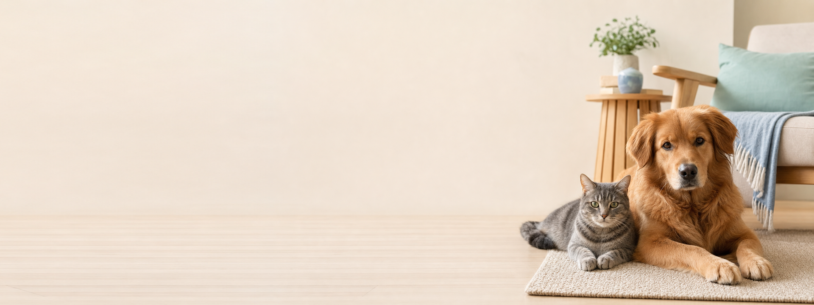

# PetCare Brand Asset Deliverables

This directory is the production delivery package derived from the 108-page PetCare Brand Book. It is intended for the brand website, React admin, Taro miniapp, social channels, presentations, and future design-system work.

The machine-readable contract is [`manifest.json`](./manifest.json). Keep its IDs stable and keep asset paths lowercase kebab-case.

## 1. Approved artwork authority

[`../assets/petcare-brand-positioning-logo-v1.png`](../assets/petcare-brand-positioning-logo-v1.png) is the approved **actual** PetCare brand artwork. It is not a reference or mood image. Do not redesign, reinterpret, horizontally rearrange, replace, or add a Chinese wordmark to the Logo.

The approved visual relationship is:

1. rounded ribbon house/shield Symbol;
2. four-pane window;
3. inward-facing dog on the left and cat on the right;
4. blue `#4A6CF7` and Logo mint `#5BC9B9` relationship;
5. stacked `PetCare` wordmark below the Symbol;
6. optional approved English tagline and Chinese slogan only in the full lockup.

The exact transparent PNG extractions are the production visual masters. SVGs are editable Bézier companions that preserve the approved composition; they are not alternative designs.

## 2. Directory map

```text
deliverables/
├── logo/
│   ├── svg/          # Symbol and stacked SVG companions
│   ├── png/          # Exact masters and raster sizes
│   ├── favicon/      # SVG, PNG and ICO favicons
│   └── app-icons/    # 32-1024px app and miniapp icons
├── hero/
│   ├── source/       # Approved photography source masters
│   ├── desktop/      # 1920x720 PNG/WebP
│   ├── miniapp/      # 750x340 PNG/WebP
│   └── social/       # 1200x630 PNG/WebP
├── elements/
│   ├── gradients/
│   ├── patterns/
│   ├── badges/
│   └── overlays/
├── manifest.json
└── README.md
```

## 3. Brand palette

| Token | Value | Intended use |
| --- | --- | --- |
| Primary | `#4A6CF7` | Actions, links, primary brand surfaces |
| Secondary | `#5BC8AF` | Product UI and supporting elements |
| Approved Logo mint | `#5BC9B9` | Approved Logo artwork only |
| Accent | `#F6B343` | Restrained highlights |
| Text primary | `#1F2937` / `#202632` | Product and Hero text |
| Text secondary | `#667085` | Supporting text |
| Background | `#F8FAFC` / `#FAFBFC` | Light page surfaces |
| Border | `#E6EAF0` | Dividers and subtle outlines |

Do not substitute system Secondary for the approved Logo mint inside the Logo, and do not use the Logo-only mint for general UI elements.

## 4. Logo package

### Production masters

| Version | File | Intended placement |
| --- | --- | --- |
| Approved actual primary | `logo/png/petcare-logo-approved-actual-primary.png` | Default raster master: Symbol + PetCare |
| Approved actual full lockup | `logo/png/petcare-logo-approved-actual-full-lockup.png` | Brand communications needing tagline and slogan |

### Editable SVG companions

| Family | Color | Dark | Monochrome | Reverse |
| --- | --- | --- | --- | --- |
| Stacked Logo | `petcare-logo-stacked-color.svg` | `petcare-logo-stacked-dark.svg` | `petcare-logo-stacked-monochrome.svg` | `petcare-logo-stacked-reverse.svg` |
| Symbol | `petcare-symbol-color.svg` | `petcare-symbol-dark.svg` | `petcare-symbol-monochrome.svg` | `petcare-symbol-reverse.svg` |

All files above are in `logo/svg/`.

### Raster derivatives

- Stacked Logo: color, dark, monochrome, and reverse at `260h`, `520h`, and `780h`.
- Color Symbol: `16`, `20`, `24`, `28`, `32`, `48`, `64`, `128`, `256`, `512`, and `1024` px.
- Favicons: SVG, PNG at `16`, `32`, and `48` px, plus multi-size ICO.
- App/miniapp icons: `32`, `48`, `64`, `96`, `128`, `144`, `180`, `192`, `512`, and `1024` px.

### Placement rules

- Clear space: at least `0.25H` on every side, where `H` is Symbol height.
- Website header: 32px Symbol height.
- Compact UI: 24-32px.
- Brand display: 48px, maximum 64px unless an approved campaign layout states otherwise.
- Never stretch, rotate, recolor, shadow, outline, crop, or place the Logo over a busy area without a controlled surface.
- No horizontal Logo lockup is approved.

## 5. Hero photography package

Hero files contain photography only. Render Logo, heading, copy, CTA, and controls as HTML so they remain accessible, localizable, and responsive.

| Theme | Message | Subject side | Copy safe zone | Suggested alt text |
| --- | --- | --- | --- | --- |
| Trusted Care | calm trust and safe companionship | right | `left-40` | A cat and dog resting peacefully in a modern living room with natural light. |
| Professional Care | organized, transparent daily care | left | `right-40` | A tidy home pet-care station with fresh water, measured food, and a cat nearby. |
| Community Companion | warm connection and shared life | right | `left-40` | A cat and dog sharing a relaxed moment in a sunlit living room. |

Each theme includes:

- Source master: `1672x941` PNG in `hero/source/`.
- Desktop: `1920x720` PNG and WebP.
- Miniapp: `750x340` PNG and WebP.
- Social: `1200x630` PNG and WebP.

The complete generation/edit prompts, provenance, dates, and source relationships are stored in `manifest.json` under `sourceProvenance`. Do not regenerate a selected source unless a new brand review explicitly approves the replacement.

### Responsive image example

```html
<picture>
  <source srcset="hero/desktop/hero-trusted-care-desktop-v1.webp" type="image/webp" />
  
</picture>
```

## 6. Reusable website elements

| Element | File | Use |
| --- | --- | --- |
| Linear gradient | `elements/gradients/petcare-gradient-linear.svg` | restrained brand surface or section accent |
| Radial gradient | `elements/gradients/petcare-gradient-radial.svg` | low-contrast Hero/section glow |
| Soft background | `elements/gradients/petcare-background-soft.svg` | light website section background |
| Connection pattern | `elements/patterns/petcare-connection-pattern.svg` | subtle community/connection texture |
| Symbol badge | `elements/badges/petcare-badge-symbol.svg` | trust mark or compact brand badge |
| Trusted Companion badge | `elements/badges/petcare-badge-trusted-companion.svg` | verified service/brand statement |
| Left copy overlay | `elements/overlays/petcare-overlay-copy-left.svg` | dark copy over a left Hero safe zone |
| Right copy overlay | `elements/overlays/petcare-overlay-copy-right.svg` | dark copy over a right Hero safe zone |
| Bottom overlay | `elements/overlays/petcare-overlay-bottom.svg` | white bottom caption or carousel metadata |

Badge SVGs contain the exact approved Symbol Bézier markup and have no external dependency. All SVGs remain editable and self-contained.

## 7. Accessibility and carousel behavior

Measured across all nine final PNG crops:

| Combination | Verified region | Minimum measured contrast | Requirement |
| --- | --- | --- | --- |
| Light side overlay + `#202632` | declared side 40% | `13.81:1` | passes AA body and large text |
| Dark bottom overlay + `#FFFFFF` | bottom 20% | `7.46:1` | passes AA body and large text |

Re-test contrast after changing any photograph, overlay, opacity, or text color. Do not communicate state through color alone.

If a carousel autoplays:

- provide visible pause/play controls;
- pause on pointer hover and keyboard focus;
- preserve keyboard focus when slides change;
- announce slide position without repeatedly interrupting screen readers;
- stop autoplay when `prefers-reduced-motion: reduce` is active;
- use meaningful alternative text and do not duplicate visible captions in alt text.

```css
@media (prefers-reduced-motion: reduce) {
  .petcare-carousel {
    scroll-behavior: auto;
  }

  .petcare-carousel [data-autoplay] {
    animation: none;
  }
}
```

## 8. Regeneration and validation

Run from the repository root:

```powershell
# Re-extract the approved actual transparent raster masters
powershell -ExecutionPolicy Bypass -File scripts/brand-assets/extract_approved_logo_assets.ps1

# Rebuild Logo derivatives
python scripts/brand-assets/export_logo_assets.py

# Rebuild responsive Hero derivatives and website elements
python scripts/brand-assets/process_hero_assets.py

# Validate every manifest asset and source relationship
python scripts/brand-assets/validate_brand_assets.py

# Repository whitespace check
git diff --check
```

Expected validator output:

```text
Validated PetCare brand assets: 0 errors
```

The Hero build embeds a fixed sRGB ICC header and is byte-for-byte deterministic. PNG uses optimized lossless output; WebP uses quality 88.

## 9. Manifest contract

Every delivered asset has a stable ID, path, kind, dimensions, and format. Placement-specific records also include safe zone, alt text, role, source, or generation provenance where applicable.

Stable prefixes:

- `logo.*`
- `hero.trusted-care.*`
- `hero.professional-care.*`
- `hero.community-companion.*`
- `element.*`

Consumers should resolve assets by ID rather than inventing filenames. Any approved replacement must update the file, manifest, README, validation expectations, and brand review record together.
